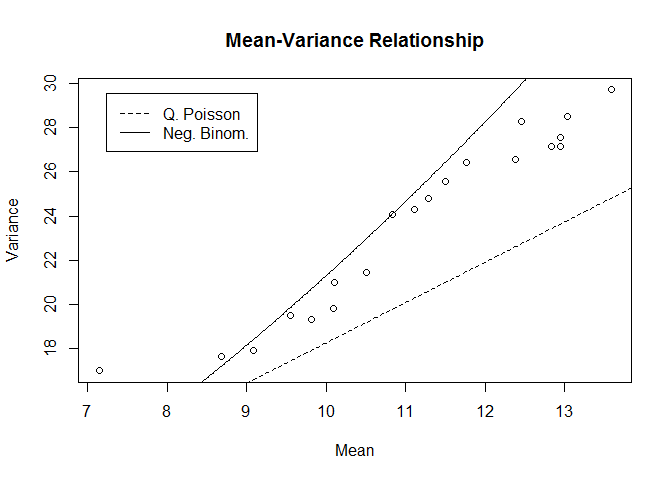

Project
================

Libraries used: tidyverse, lubridate, AER, MASS, sandwich, arm

\#\#Data

Probably don’t need to change date as I don’t use it as a variable..more
for merging purposes. Should probably format the wday to Sun, Mon etc.
instead of 1-7

``` r
raw<- read.csv("C:/Users/ADMIN/Desktop/SlackFiles/all_vars.csv")

#changing variables to factors
cols<- c('broncos','rockies','nuggets','precip')
  raw[,cols]<- data.frame(apply(raw[cols],2, as.factor))
   raw$wday<-as.factor(raw$wday)

calls<- raw %>% 
   mutate(Date = ymd_hms(raw$Date))
summary(calls)
```

    ##       Date                           n              Year     
    ##  Min.   :2011-01-01 00:00:00   Min.   : 0.00   Min.   :2011  
    ##  1st Qu.:2013-01-10 22:00:00   1st Qu.: 7.00   1st Qu.:2013  
    ##  Median :2015-01-21 20:00:00   Median :11.00   Median :2015  
    ##  Mean   :2015-01-21 20:00:00   Mean   :11.09   Mean   :2015  
    ##  3rd Qu.:2017-01-31 18:00:00   3rd Qu.:15.00   3rd Qu.:2017  
    ##  Max.   :2019-02-11 16:00:00   Max.   :95.00   Max.   :2019  
    ##                                                              
    ##       Hour          Month             yday       wday          pick      
    ##  Min.   : 0.0   Min.   : 1.000   Min.   :  1.0   1:10176   Fall  :23424  
    ##  1st Qu.: 5.0   1st Qu.: 3.000   1st Qu.: 88.0   2:10169   Spring:24089  
    ##  Median :11.0   Median : 6.000   Median :181.0   3:10152   Summer:23616  
    ##  Mean   :11.5   Mean   : 6.449   Mean   :180.8   4:10152                 
    ##  3rd Qu.:17.0   3rd Qu.: 9.000   3rd Qu.:273.0   5:10152                 
    ##  Max.   :23.0   Max.   :12.000   Max.   :366.0   6:10152                 
    ##                                                  7:10176                 
    ##     hr_index         Temp         precip      broncos   rockies  
    ##  Min.   : 1.0   Min.   :-27.20   0   :66698   0:70837   0:68597  
    ##  1st Qu.: 6.0   1st Qu.:  2.20   1   : 4029   1:  292   1: 2532  
    ##  Median :12.0   Median : 11.10   NA's:  402                      
    ##  Mean   :12.5   Mean   : 10.79                                   
    ##  3rd Qu.:19.0   3rd Qu.: 18.90                                   
    ##  Max.   :24.0   Max.   : 39.40                                   
    ##                 NA's   :402                                      
    ##  nuggets  
    ##  0:70075  
    ##  1: 1054  
    ##           
    ##           
    ##           
    ##           
    ## 

\#\#Overdispersion

Here is a sort of crude simulation of what a regular poisson should look
like at 95% CI, The ideal ratio is 1, but nothing will be perfect.
Lambda dosen’t matter for the simulation, I did use the sample size of
our data.

``` r
Ratio = numeric()
M = 10000
for(i in 1:M){
  X = rpois(71129, lambda = 8);
  Ratio[i] = var(X)/mean(X)
}
quantile(Ratio, c(0.025, 0.975))
```

    ##      2.5%     97.5% 
    ## 0.9896819 1.0102795

``` r
var(calls$n)/mean(calls$n)
```

    ## [1] 2.3862

This ratio is significantly larger than 1 and well outside the simulated
95% CI suggesting overdispersion

\#\#Regular Poisson Full model with hour instead of hr\_index

``` r
#full model with unmodified hour
callsp<- glm(n ~ Year+Hour+Month+yday+wday+pick+Temp+precip+broncos+rockies+nuggets, data = calls, 
             family = 'poisson')
  summary(callsp)
```

    ## 
    ## Call:
    ## glm(formula = n ~ Year + Hour + Month + yday + wday + pick + 
    ##     Temp + precip + broncos + rockies + nuggets, family = "poisson", 
    ##     data = calls)
    ## 
    ## Deviance Residuals: 
    ##    Min      1Q  Median      3Q     Max  
    ## -5.901  -1.040  -0.106   0.829  16.795  
    ## 
    ## Coefficients:
    ##               Estimate Std. Error z value Pr(>|z|)    
    ## (Intercept) -9.371e+01  9.843e-01 -95.203  < 2e-16 ***
    ## Year         4.751e-02  4.884e-04  97.286  < 2e-16 ***
    ## Hour         3.004e-02  1.760e-04 170.728  < 2e-16 ***
    ## Month        4.345e-02  4.022e-03  10.803  < 2e-16 ***
    ## yday        -1.438e-03  1.283e-04 -11.209  < 2e-16 ***
    ## wday2       -5.785e-04  4.249e-03  -0.136 0.891697    
    ## wday3       -1.969e-02  4.271e-03  -4.612 4.00e-06 ***
    ## wday4       -2.010e-02  4.275e-03  -4.700 2.60e-06 ***
    ## wday5       -4.260e-03  4.255e-03  -1.001 0.316719    
    ## wday6        3.554e-02  4.218e-03   8.427  < 2e-16 ***
    ## wday7        4.166e-02  4.201e-03   9.917  < 2e-16 ***
    ## pickSpring  -4.290e-02  8.590e-03  -4.995 5.90e-07 ***
    ## pickSummer   5.891e-02  5.121e-03  11.505  < 2e-16 ***
    ## Temp        -5.727e-04  1.330e-04  -4.306 1.67e-05 ***
    ## precip1     -3.609e-02  5.134e-03  -7.030 2.07e-12 ***
    ## broncos1     5.825e-02  1.601e-02   3.639 0.000274 ***
    ## rockies1     7.826e-02  5.522e-03  14.171  < 2e-16 ***
    ## nuggets1    -9.325e-02  8.983e-03 -10.381  < 2e-16 ***
    ## ---
    ## Signif. codes:  0 '***' 0.001 '**' 0.01 '*' 0.05 '.' 0.1 ' ' 1
    ## 
    ## (Dispersion parameter for poisson family taken to be 1)
    ## 
    ##     Null deviance: 176099  on 70726  degrees of freedom
    ## Residual deviance: 131026  on 70709  degrees of freedom
    ##   (402 observations deleted due to missingness)
    ## AIC: 423000
    ## 
    ## Number of Fisher Scoring iterations: 4

Goodness of Fit:

``` r
  with(callsp, cbind(res.deviance = deviance, df = df.residual, 
                     p = pchisq(deviance, df.residual, lower.tail = F)))
```

    ##      res.deviance    df p
    ## [1,]     131025.9 70709 0

Recall the null assumes a good fit

With the indexed
hr:

``` r
Pindex<- glm(n ~ Year+hr_index+Month+yday+wday+pick+Temp+precip+broncos+rockies+nuggets, data = calls,
             family = 'poisson')
summary(Pindex)
```

    ## 
    ## Call:
    ## glm(formula = n ~ Year + hr_index + Month + yday + wday + pick + 
    ##     Temp + precip + broncos + rockies + nuggets, family = "poisson", 
    ##     data = calls)
    ## 
    ## Deviance Residuals: 
    ##     Min       1Q   Median       3Q      Max  
    ## -5.3015  -1.1701  -0.0601   0.9447  14.9845  
    ## 
    ## Coefficients:
    ##               Estimate Std. Error z value Pr(>|z|)    
    ## (Intercept) -9.273e+01  9.846e-01 -94.181  < 2e-16 ***
    ## Year         4.722e-02  4.885e-04  96.658  < 2e-16 ***
    ## hr_index    -8.488e-03  1.732e-04 -49.001  < 2e-16 ***
    ## Month        4.332e-02  4.024e-03  10.766  < 2e-16 ***
    ## yday        -1.422e-03  1.284e-04 -11.071  < 2e-16 ***
    ## wday2        5.268e-03  4.250e-03   1.240 0.215085    
    ## wday3       -1.270e-02  4.270e-03  -2.973 0.002950 ** 
    ## wday4       -1.460e-02  4.275e-03  -3.414 0.000641 ***
    ## wday5        4.385e-03  4.256e-03   1.031 0.302771    
    ## wday6        3.758e-02  4.217e-03   8.911  < 2e-16 ***
    ## wday7        4.497e-02  4.201e-03  10.705  < 2e-16 ***
    ## pickSpring  -7.220e-03  8.518e-03  -0.848 0.396609    
    ## pickSummer  -2.717e-02  5.045e-03  -5.386 7.19e-08 ***
    ## Temp         6.805e-03  1.375e-04  49.479  < 2e-16 ***
    ## precip1     -2.225e-02  5.131e-03  -4.336 1.45e-05 ***
    ## broncos1     2.412e-01  1.599e-02  15.088  < 2e-16 ***
    ## rockies1     2.254e-01  5.473e-03  41.190  < 2e-16 ***
    ## nuggets1     1.566e-01  8.922e-03  17.555  < 2e-16 ***
    ## ---
    ## Signif. codes:  0 '***' 0.001 '**' 0.01 '*' 0.05 '.' 0.1 ' ' 1
    ## 
    ## (Dispersion parameter for poisson family taken to be 1)
    ## 
    ##     Null deviance: 176099  on 70726  degrees of freedom
    ## Residual deviance: 158349  on 70709  degrees of freedom
    ##   (402 observations deleted due to missingness)
    ## AIC: 450323
    ## 
    ## Number of Fisher Scoring iterations: 4

GOF:

    ##      res.deviance    df p
    ## [1,]       158349 70709 0

Still not a good fit. Using the indexed hour changes the coef values and
increases the dispersion ratio

We can also test for overdispersion here:

``` r
dispersiontest(callsp);dispersiontest(Pindex)
```

    ## 
    ##  Overdispersion test
    ## 
    ## data:  callsp
    ## z = 49.589, p-value < 2.2e-16
    ## alternative hypothesis: true dispersion is greater than 1
    ## sample estimates:
    ## dispersion 
    ##   1.827553

    ## 
    ##  Overdispersion test
    ## 
    ## data:  Pindex
    ## z = 82.739, p-value < 2.2e-16
    ## alternative hypothesis: true dispersion is greater than 1
    ## sample estimates:
    ## dispersion 
    ##   2.143778

As expected, overdispersion is present

\#\#QuasiPoisson

Gives a dispersion parameter to adjust for the Var \>
Mean

``` r
callsqp<- glm(n ~ Year+Hour+Month+yday+wday+pick+Temp+precip+broncos+rockies+nuggets, data = calls,
              family = 'quasipoisson')
 summary(callsqp)
```

    ## 
    ## Call:
    ## glm(formula = n ~ Year + Hour + Month + yday + wday + pick + 
    ##     Temp + precip + broncos + rockies + nuggets, family = "quasipoisson", 
    ##     data = calls)
    ## 
    ## Deviance Residuals: 
    ##    Min      1Q  Median      3Q     Max  
    ## -5.901  -1.040  -0.106   0.829  16.795  
    ## 
    ## Coefficients:
    ##               Estimate Std. Error t value Pr(>|t|)    
    ## (Intercept) -9.371e+01  1.330e+00 -70.460  < 2e-16 ***
    ## Year         4.751e-02  6.599e-04  72.001  < 2e-16 ***
    ## Hour         3.004e-02  2.378e-04 126.355  < 2e-16 ***
    ## Month        4.345e-02  5.435e-03   7.995 1.31e-15 ***
    ## yday        -1.438e-03  1.733e-04  -8.296  < 2e-16 ***
    ## wday2       -5.785e-04  5.741e-03  -0.101 0.919734    
    ## wday3       -1.969e-02  5.770e-03  -3.413 0.000643 ***
    ## wday4       -2.010e-02  5.777e-03  -3.479 0.000504 ***
    ## wday5       -4.260e-03  5.749e-03  -0.741 0.458695    
    ## wday6        3.554e-02  5.699e-03   6.237 4.50e-10 ***
    ## wday7        4.166e-02  5.676e-03   7.339 2.17e-13 ***
    ## pickSpring  -4.290e-02  1.161e-02  -3.696 0.000219 ***
    ## pickSummer   5.891e-02  6.919e-03   8.515  < 2e-16 ***
    ## Temp        -5.727e-04  1.797e-04  -3.187 0.001441 ** 
    ## precip1     -3.609e-02  6.936e-03  -5.203 1.97e-07 ***
    ## broncos1     5.825e-02  2.163e-02   2.693 0.007080 ** 
    ## rockies1     7.826e-02  7.462e-03  10.488  < 2e-16 ***
    ## nuggets1    -9.325e-02  1.214e-02  -7.683 1.58e-14 ***
    ## ---
    ## Signif. codes:  0 '***' 0.001 '**' 0.01 '*' 0.05 '.' 0.1 ' ' 1
    ## 
    ## (Dispersion parameter for quasipoisson family taken to be 1.825676)
    ## 
    ##     Null deviance: 176099  on 70726  degrees of freedom
    ## Residual deviance: 131026  on 70709  degrees of freedom
    ##   (402 observations deleted due to missingness)
    ## AIC: NA
    ## 
    ## Number of Fisher Scoring iterations: 4

Comparing quasipoisson and regular poisson

``` r
Poi = coef(callsp); QPoi = coef(callsqp)
ErrorP = se.coef(callsp); ErrorQP = se.coef(callsqp)
 
compare<- cbind(Poi, QPoi, ErrorP, ErrorQP)
 compare
```

    ##                       Poi          QPoi       ErrorP      ErrorQP
    ## (Intercept) -9.370625e+01 -9.370625e+01 0.9842749536 1.3299286180
    ## Year         4.751146e-02  4.751146e-02 0.0004883672 0.0006598700
    ## Hour         3.004493e-02  3.004493e-02 0.0001759809 0.0002377811
    ## Month        4.345138e-02  4.345138e-02 0.0040221871 0.0054346824
    ## yday        -1.438096e-03 -1.438096e-03 0.0001282946 0.0001733485
    ## wday2       -5.785158e-04 -5.785158e-04 0.0042488917 0.0057410002
    ## wday3       -1.969394e-02 -1.969394e-02 0.0042705860 0.0057703130
    ## wday4       -2.009659e-02 -2.009659e-02 0.0042754819 0.0057769282
    ## wday5       -4.260320e-03 -4.260320e-03 0.0042551184 0.0057494135
    ## wday6        3.554037e-02  3.554037e-02 0.0042175802 0.0056986928
    ## wday7        4.165963e-02  4.165963e-02 0.0042009258 0.0056761898
    ## pickSpring  -4.290505e-02 -4.290505e-02 0.0085903588 0.0116070860
    ## pickSummer   5.891389e-02  5.891389e-02 0.0051205320 0.0069187395
    ## Temp        -5.727425e-04 -5.727425e-04 0.0001330239 0.0001797387
    ## precip1     -3.608739e-02 -3.608739e-02 0.0051335272 0.0069362984
    ## broncos1     5.825116e-02  5.825116e-02 0.0160079083 0.0216295003
    ## rockies1     7.825510e-02  7.825510e-02 0.0055223533 0.0074616709
    ## nuggets1    -9.325268e-02 -9.325268e-02 0.0089833845 0.0121381329

Essentially this is what quasi poisson does: Notice the coef are the
same, quasipoisson adjusts the SE to account for dispersion.

Some Drawbacks of using the quasi-likelihood: it lacks a log-likelihood
Prevents you from using likelihood-based tools; ratio tests, AIC/BIC,
deviance

\#Negative
Binomial

``` r
callsnb<- glm.nb(n ~ Year+Hour+Month+yday+wday+pick+Temp+precip+broncos+rockies+nuggets, data = calls)
  summary(callsnb)
```

    ## 
    ## Call:
    ## glm.nb(formula = n ~ Year + Hour + Month + yday + wday + pick + 
    ##     Temp + precip + broncos + rockies + nuggets, data = calls, 
    ##     init.theta = 13.37785547, link = log)
    ## 
    ## Deviance Residuals: 
    ##     Min       1Q   Median       3Q      Max  
    ## -4.7640  -0.7915  -0.0795   0.6019  10.5487  
    ## 
    ## Coefficients:
    ##               Estimate Std. Error z value Pr(>|z|)    
    ## (Intercept) -9.473e+01  1.338e+00 -70.790  < 2e-16 ***
    ## Year         4.801e-02  6.640e-04  72.310  < 2e-16 ***
    ## Hour         3.168e-02  2.370e-04 133.671  < 2e-16 ***
    ## Month        4.435e-02  5.479e-03   8.096 5.70e-16 ***
    ## yday        -1.471e-03  1.748e-04  -8.415  < 2e-16 ***
    ## wday2       -9.378e-03  5.772e-03  -1.625 0.104224    
    ## wday3       -3.205e-02  5.792e-03  -5.533 3.15e-08 ***
    ## wday4       -3.224e-02  5.797e-03  -5.562 2.67e-08 ***
    ## wday5       -1.679e-02  5.780e-03  -2.904 0.003680 ** 
    ## wday6        2.183e-02  5.756e-03   3.792 0.000149 ***
    ## wday7        3.433e-02  5.733e-03   5.989 2.11e-09 ***
    ## pickSpring  -4.317e-02  1.169e-02  -3.692 0.000222 ***
    ## pickSummer   5.535e-02  6.982e-03   7.927 2.24e-15 ***
    ## Temp        -3.986e-04  1.809e-04  -2.203 0.027587 *  
    ## precip1     -3.211e-02  6.885e-03  -4.665 3.09e-06 ***
    ## broncos1     4.534e-02  2.287e-02   1.983 0.047374 *  
    ## rockies1     7.226e-02  7.957e-03   9.082  < 2e-16 ***
    ## nuggets1    -1.050e-01  1.251e-02  -8.399  < 2e-16 ***
    ## ---
    ## Signif. codes:  0 '***' 0.001 '**' 0.01 '*' 0.05 '.' 0.1 ' ' 1
    ## 
    ## (Dispersion parameter for Negative Binomial(13.3779) family taken to be 1)
    ## 
    ##     Null deviance: 100302  on 70726  degrees of freedom
    ## Residual deviance:  74689  on 70709  degrees of freedom
    ##   (402 observations deleted due to missingness)
    ## AIC: 408158
    ## 
    ## Number of Fisher Scoring iterations: 1
    ## 
    ## 
    ##               Theta:  13.378 
    ##           Std. Err.:  0.164 
    ## 
    ##  2 x log-likelihood:  -408120.009

Using Indexed
hr:

``` r
NBindex<- glm.nb(n ~ Year+hr_index+Month+yday+wday+pick+Temp+precip+broncos+rockies+nuggets, data = calls)
  summary(NBindex)
```

    ## 
    ## Call:
    ## glm.nb(formula = n ~ Year + hr_index + Month + yday + wday + 
    ##     pick + Temp + precip + broncos + rockies + nuggets, data = calls, 
    ##     init.theta = 8.857715354, link = log)
    ## 
    ## Deviance Residuals: 
    ##     Min       1Q   Median       3Q      Max  
    ## -4.1316  -0.8090  -0.0399   0.6129   7.6936  
    ## 
    ## Coefficients:
    ##               Estimate Std. Error z value Pr(>|z|)    
    ## (Intercept) -9.370e+01  1.478e+00 -63.410  < 2e-16 ***
    ## Year         4.771e-02  7.332e-04  65.068  < 2e-16 ***
    ## hr_index    -9.829e-03  2.584e-04 -38.041  < 2e-16 ***
    ## Month        4.481e-02  6.053e-03   7.403 1.33e-13 ***
    ## yday        -1.465e-03  1.931e-04  -7.583 3.38e-14 ***
    ## wday2       -7.953e-05  6.381e-03  -0.012 0.990055    
    ## wday3       -1.866e-02  6.396e-03  -2.917 0.003533 ** 
    ## wday4       -2.018e-02  6.403e-03  -3.152 0.001619 ** 
    ## wday5       -1.559e-03  6.387e-03  -0.244 0.807134    
    ## wday6        3.252e-02  6.363e-03   5.111 3.21e-07 ***
    ## wday7        4.402e-02  6.342e-03   6.941 3.91e-12 ***
    ## pickSpring  -6.019e-03  1.286e-02  -0.468 0.639828    
    ## pickSummer  -2.907e-02  7.671e-03  -3.790 0.000151 ***
    ## Temp         6.926e-03  2.053e-04  33.741  < 2e-16 ***
    ## precip1     -2.053e-02  7.579e-03  -2.709 0.006756 ** 
    ## broncos1     2.442e-01  2.563e-02   9.528  < 2e-16 ***
    ## rockies1     2.271e-01  8.849e-03  25.669  < 2e-16 ***
    ## nuggets1     1.621e-01  1.385e-02  11.701  < 2e-16 ***
    ## ---
    ## Signif. codes:  0 '***' 0.001 '**' 0.01 '*' 0.05 '.' 0.1 ' ' 1
    ## 
    ## (Dispersion parameter for Negative Binomial(8.8577) family taken to be 1)
    ## 
    ##     Null deviance: 82806  on 70726  degrees of freedom
    ## Residual deviance: 74767  on 70709  degrees of freedom
    ##   (402 observations deleted due to missingness)
    ## AIC: 422437
    ## 
    ## Number of Fisher Scoring iterations: 1
    ## 
    ## 
    ##               Theta:  8.8577 
    ##           Std. Err.:  0.0886 
    ## 
    ##  2 x log-likelihood:  -422398.6830

GOF:

    ##      res.deviance    df            p
    ## [1,]     74688.62 70709 1.347968e-25

    ##      res.deviance    df            p
    ## [1,]     74766.89 70709 1.611664e-26

the first is without the hr index. Looks better than poisson, but still
signifcant depature

\#\#NegBin vs Poisson

An interesting way to explore this graphically. Create groups based on
the predictors, compute the mean and variance for each group and plot
the mean-variance relationship.

Groups created using “cut” with breaks at the 5/95/5 percentiles to get
20 groups approx equal in size (source is written down, so and so from
Princeton)

``` r
colSums(is.na(calls))
```

    ##     Date        n     Year     Hour    Month     yday     wday     pick 
    ##        0        0        0        0        0        0        0        0 
    ## hr_index     Temp   precip  broncos  rockies  nuggets 
    ##        0      402      402        0        0        0

``` r
callsNA = na.omit(calls)  #omits 402 rows of Temperature Data

nb<-glm.nb(n ~ Year+hr_index+Month+yday+wday+pick+Temp+precip+broncos+rockies+nuggets, data = callsNA)  
 xb <- predict(nb)
  g <- cut(xb, breaks=quantile(xb,seq(0,100,5)/100))
  m <- tapply(callsNA$n, g, mean)
  v <- tapply(callsNA$n, g, var)

pr<-residuals(callsqp, 'pearson')
o <- sum(pr^2)/df.residual(callsqp)
  
plot(m, v, xlab="Mean", ylab="Variance", 
        main="Mean-Variance Relationship")

x<- seq(7, 15, .02)
z<- nb$theta
  
  lines(x, x*o, lty="dashed")
  lines(x, x*(1+x/z))
  
   legend("topleft", lty=c("dashed","solid"), 
             legend=c("Q. Poisson","Neg. Binom."), inset=0.05)
```

<!-- --> Neither one
looks great to me but NegBin looks better.

Consider cross validation method to see which fits better -Use 2019 data
(data not in the model) -Predict the 2019 data and compare predicted
vs. actual

I haven’t run any adjusted models yet: -removing insignificant
predictors -considering correlations -Testing if categories are
significant, i.e, some weekdays are, some aren’t but we shouldn’t remove
a weekday. It’s all or nothing IMO. Probably ANOVA for that?
