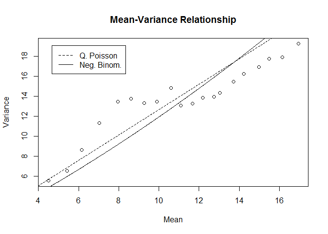

redo
================

``` r
raw<- read.csv("C:/Users/ADMIN/Desktop/SlackFiles/all_vars.csv")

#changing variables to factors
cols<- c('broncos','rockies','nuggets','precip')
  raw[,cols]<- data.frame(apply(raw[cols],2, as.factor))
   raw$wday<-as.factor(raw$wday)
   raw$Hour<-as.factor(raw$Hour)
calls<- raw %>% 
   mutate(Date = ymd_hms(raw$Date))
```

Poisson

``` r
callsp<- glm(n ~ Year+Hour+Month+yday+wday+pick+Temp+precip+broncos+rockies+nuggets, data = calls, 
             family = 'poisson')
  summary(callsp)
```

    ## 
    ## Call:
    ## glm(formula = n ~ Year + Hour + Month + yday + wday + pick + 
    ##     Temp + precip + broncos + rockies + nuggets, family = "poisson", 
    ##     data = calls)
    ## 
    ## Deviance Residuals: 
    ##     Min       1Q   Median       3Q      Max  
    ## -5.5785  -0.8201  -0.0853   0.6626  15.8041  
    ## 
    ## Coefficients:
    ##               Estimate Std. Error z value Pr(>|z|)    
    ## (Intercept) -9.322e+01  9.845e-01 -94.681  < 2e-16 ***
    ## Year         4.732e-02  4.885e-04  96.878  < 2e-16 ***
    ## Hour1       -5.316e-02  8.752e-03  -6.074 1.25e-09 ***
    ## Hour2       -1.163e-01  8.935e-03 -13.014  < 2e-16 ***
    ## Hour3       -4.018e-01  9.711e-03 -41.378  < 2e-16 ***
    ## Hour4       -5.802e-01  1.029e-02 -56.370  < 2e-16 ***
    ## Hour5       -5.599e-01  1.024e-02 -54.687  < 2e-16 ***
    ## Hour6       -3.583e-01  9.631e-03 -37.201  < 2e-16 ***
    ## Hour7       -6.673e-02  8.908e-03  -7.490 6.88e-14 ***
    ## Hour8        1.102e-01  8.542e-03  12.903  < 2e-16 ***
    ## Hour9        2.391e-01  8.299e-03  28.812  < 2e-16 ***
    ## Hour10       3.436e-01  8.137e-03  42.223  < 2e-16 ***
    ## Hour11       4.231e-01  8.019e-03  52.758  < 2e-16 ***
    ## Hour12       4.516e-01  7.967e-03  56.678  < 2e-16 ***
    ## Hour13       4.659e-01  7.967e-03  58.478  < 2e-16 ***
    ## Hour14       4.739e-01  7.913e-03  59.887  < 2e-16 ***
    ## Hour15       5.056e-01  7.809e-03  64.744  < 2e-16 ***
    ## Hour16       5.223e-01  7.747e-03  67.418  < 2e-16 ***
    ## Hour17       5.067e-01  7.727e-03  65.570  < 2e-16 ***
    ## Hour18       4.612e-01  7.824e-03  58.944  < 2e-16 ***
    ## Hour19       4.097e-01  7.953e-03  51.511  < 2e-16 ***
    ## Hour20       3.599e-01  8.043e-03  44.742  < 2e-16 ***
    ## Hour21       2.970e-01  8.129e-03  36.540  < 2e-16 ***
    ## Hour22       2.104e-01  8.183e-03  25.716  < 2e-16 ***
    ## Hour23       8.877e-02  8.417e-03  10.546  < 2e-16 ***
    ## Month        4.558e-02  4.023e-03  11.329  < 2e-16 ***
    ## yday        -1.506e-03  1.284e-04 -11.733  < 2e-16 ***
    ## wday2       -1.559e-03  4.252e-03  -0.367   0.7139    
    ## wday3       -1.873e-02  4.272e-03  -4.384 1.17e-05 ***
    ## wday4       -1.965e-02  4.277e-03  -4.594 4.35e-06 ***
    ## wday5       -4.650e-03  4.258e-03  -1.092   0.2748    
    ## wday6        3.506e-02  4.218e-03   8.313  < 2e-16 ***
    ## wday7        4.130e-02  4.202e-03   9.829  < 2e-16 ***
    ## pickSpring  -2.098e-02  8.557e-03  -2.451   0.0142 *  
    ## pickSummer   4.727e-03  5.114e-03   0.924   0.3553    
    ## Temp         4.533e-03  1.469e-04  30.854  < 2e-16 ***
    ## precip1     -9.747e-03  5.217e-03  -1.868   0.0617 .  
    ## broncos1     3.306e-02  1.606e-02   2.059   0.0395 *  
    ## rockies1     1.661e-03  5.679e-03   0.293   0.7699    
    ## nuggets1    -1.680e-02  9.252e-03  -1.816   0.0694 .  
    ## ---
    ## Signif. codes:  0 '***' 0.001 '**' 0.01 '*' 0.05 '.' 0.1 ' ' 1
    ## 
    ## (Dispersion parameter for poisson family taken to be 1)
    ## 
    ##     Null deviance: 176099  on 70726  degrees of freedom
    ## Residual deviance:  89004  on 70687  degrees of freedom
    ##   (402 observations deleted due to missingness)
    ## AIC: 381023
    ## 
    ## Number of Fisher Scoring iterations: 4

GOF

    ##      res.deviance    df p
    ## [1,]     89004.42 70687 0

QPoisson:

``` r
callsqp<- glm(n ~ Year+Hour+Month+yday+wday+pick+Temp+precip+broncos+rockies+nuggets, data = calls,
              family = 'quasipoisson')
 summary(callsqp)
```

    ## 
    ## Call:
    ## glm(formula = n ~ Year + Hour + Month + yday + wday + pick + 
    ##     Temp + precip + broncos + rockies + nuggets, family = "quasipoisson", 
    ##     data = calls)
    ## 
    ## Deviance Residuals: 
    ##     Min       1Q   Median       3Q      Max  
    ## -5.5785  -0.8201  -0.0853   0.6626  15.8041  
    ## 
    ## Coefficients:
    ##               Estimate Std. Error t value Pr(>|t|)    
    ## (Intercept) -9.322e+01  1.108e+00 -84.103  < 2e-16 ***
    ## Year         4.732e-02  5.499e-04  86.055  < 2e-16 ***
    ## Hour1       -5.316e-02  9.853e-03  -5.395 6.87e-08 ***
    ## Hour2       -1.163e-01  1.006e-02 -11.560  < 2e-16 ***
    ## Hour3       -4.018e-01  1.093e-02 -36.755  < 2e-16 ***
    ## Hour4       -5.802e-01  1.159e-02 -50.072  < 2e-16 ***
    ## Hour5       -5.599e-01  1.153e-02 -48.577  < 2e-16 ***
    ## Hour6       -3.583e-01  1.084e-02 -33.045  < 2e-16 ***
    ## Hour7       -6.673e-02  1.003e-02  -6.653 2.88e-11 ***
    ## Hour8        1.102e-01  9.616e-03  11.461  < 2e-16 ***
    ## Hour9        2.391e-01  9.343e-03  25.593  < 2e-16 ***
    ## Hour10       3.436e-01  9.161e-03  37.506  < 2e-16 ***
    ## Hour11       4.231e-01  9.028e-03  46.864  < 2e-16 ***
    ## Hour12       4.516e-01  8.969e-03  50.346  < 2e-16 ***
    ## Hour13       4.659e-01  8.969e-03  51.945  < 2e-16 ***
    ## Hour14       4.739e-01  8.909e-03  53.197  < 2e-16 ***
    ## Hour15       5.056e-01  8.791e-03  57.511  < 2e-16 ***
    ## Hour16       5.223e-01  8.722e-03  59.886  < 2e-16 ***
    ## Hour17       5.067e-01  8.699e-03  58.245  < 2e-16 ***
    ## Hour18       4.612e-01  8.808e-03  52.359  < 2e-16 ***
    ## Hour19       4.097e-01  8.953e-03  45.756  < 2e-16 ***
    ## Hour20       3.599e-01  9.055e-03  39.744  < 2e-16 ***
    ## Hour21       2.970e-01  9.151e-03  32.458  < 2e-16 ***
    ## Hour22       2.104e-01  9.213e-03  22.843  < 2e-16 ***
    ## Hour23       8.877e-02  9.475e-03   9.368  < 2e-16 ***
    ## Month        4.558e-02  4.529e-03  10.063  < 2e-16 ***
    ## yday        -1.506e-03  1.445e-04 -10.422  < 2e-16 ***
    ## wday2       -1.559e-03  4.787e-03  -0.326   0.7447    
    ## wday3       -1.873e-02  4.810e-03  -3.894 9.87e-05 ***
    ## wday4       -1.965e-02  4.815e-03  -4.081 4.49e-05 ***
    ## wday5       -4.650e-03  4.794e-03  -0.970   0.3321    
    ## wday6        3.506e-02  4.749e-03   7.384 1.55e-13 ***
    ## wday7        4.130e-02  4.730e-03   8.731  < 2e-16 ***
    ## pickSpring  -2.098e-02  9.633e-03  -2.178   0.0294 *  
    ## pickSummer   4.727e-03  5.757e-03   0.821   0.4116    
    ## Temp         4.533e-03  1.654e-04  27.407  < 2e-16 ***
    ## precip1     -9.747e-03  5.874e-03  -1.660   0.0970 .  
    ## broncos1     3.306e-02  1.808e-02   1.829   0.0675 .  
    ## rockies1     1.661e-03  6.393e-03   0.260   0.7950    
    ## nuggets1    -1.680e-02  1.042e-02  -1.613   0.1068    
    ## ---
    ## Signif. codes:  0 '***' 0.001 '**' 0.01 '*' 0.05 '.' 0.1 ' ' 1
    ## 
    ## (Dispersion parameter for quasipoisson family taken to be 1.267361)
    ## 
    ##     Null deviance: 176099  on 70726  degrees of freedom
    ## Residual deviance:  89004  on 70687  degrees of freedom
    ##   (402 observations deleted due to missingness)
    ## AIC: NA
    ## 
    ## Number of Fisher Scoring iterations: 4

NegBin:

``` r
callsnb<- glm.nb(n ~ Year+Hour+Month+wday+pick+Temp+precip+broncos+rockies+nuggets, data = calls)
  summary(callsnb)
```

    ## 
    ## Call:
    ## glm.nb(formula = n ~ Year + Hour + Month + wday + pick + Temp + 
    ##     precip + broncos + rockies + nuggets, data = calls, init.theta = 51.07985651, 
    ##     link = log)
    ## 
    ## Deviance Residuals: 
    ##     Min       1Q   Median       3Q      Max  
    ## -5.1719  -0.7499  -0.0771   0.5989  12.9944  
    ## 
    ## Coefficients:
    ##               Estimate Std. Error z value Pr(>|z|)    
    ## (Intercept) -9.376e+01  1.094e+00 -85.735  < 2e-16 ***
    ## Year         4.761e-02  5.426e-04  87.736  < 2e-16 ***
    ## Hour1       -5.281e-02  9.492e-03  -5.564 2.64e-08 ***
    ## Hour2       -1.162e-01  9.664e-03 -12.022  < 2e-16 ***
    ## Hour3       -4.020e-01  1.039e-02 -38.705  < 2e-16 ***
    ## Hour4       -5.804e-01  1.094e-02 -53.074  < 2e-16 ***
    ## Hour5       -5.604e-01  1.089e-02 -51.475  < 2e-16 ***
    ## Hour6       -3.589e-01  1.032e-02 -34.781  < 2e-16 ***
    ## Hour7       -6.738e-02  9.651e-03  -6.982 2.91e-12 ***
    ## Hour8        1.100e-01  9.314e-03  11.815  < 2e-16 ***
    ## Hour9        2.391e-01  9.092e-03  26.292  < 2e-16 ***
    ## Hour10       3.435e-01  8.948e-03  38.386  < 2e-16 ***
    ## Hour11       4.228e-01  8.843e-03  47.814  < 2e-16 ***
    ## Hour12       4.508e-01  8.794e-03  51.266  < 2e-16 ***
    ## Hour13       4.655e-01  8.800e-03  52.900  < 2e-16 ***
    ## Hour14       4.736e-01  8.745e-03  54.154  < 2e-16 ***
    ## Hour15       5.051e-01  8.641e-03  58.455  < 2e-16 ***
    ## Hour16       5.225e-01  8.582e-03  60.885  < 2e-16 ***
    ## Hour17       5.070e-01  8.557e-03  59.253  < 2e-16 ***
    ## Hour18       4.613e-01  8.654e-03  53.306  < 2e-16 ***
    ## Hour19       4.098e-01  8.785e-03  46.649  < 2e-16 ***
    ## Hour20       3.598e-01  8.871e-03  40.556  < 2e-16 ***
    ## Hour21       2.970e-01  8.945e-03  33.200  < 2e-16 ***
    ## Hour22       2.103e-01  8.972e-03  23.436  < 2e-16 ***
    ## Hour23       8.854e-02  9.185e-03   9.640  < 2e-16 ***
    ## Month       -7.000e-05  1.117e-03  -0.063  0.95003    
    ## wday2       -8.010e-03  4.719e-03  -1.697  0.08963 .  
    ## wday3       -2.699e-02  4.740e-03  -5.695 1.23e-08 ***
    ## wday4       -2.761e-02  4.745e-03  -5.819 5.93e-09 ***
    ## wday5       -1.242e-02  4.727e-03  -2.627  0.00861 ** 
    ## wday6        2.761e-02  4.691e-03   5.887 3.94e-09 ***
    ## wday7        3.885e-02  4.670e-03   8.320  < 2e-16 ***
    ## pickSpring  -1.929e-02  9.518e-03  -2.026  0.04272 *  
    ## pickSummer   6.940e-03  5.698e-03   1.218  0.22326    
    ## Temp         4.455e-03  1.629e-04  27.344  < 2e-16 ***
    ## precip1     -8.566e-03  5.764e-03  -1.486  0.13720    
    ## broncos1     3.034e-02  1.814e-02   1.673  0.09435 .  
    ## rockies1     3.199e-03  6.437e-03   0.497  0.61919    
    ## nuggets1    -1.595e-02  1.034e-02  -1.542  0.12297    
    ## ---
    ## Signif. codes:  0 '***' 0.001 '**' 0.01 '*' 0.05 '.' 0.1 ' ' 1
    ## 
    ## (Dispersion parameter for Negative Binomial(51.0799) family taken to be 1)
    ## 
    ##     Null deviance: 146244  on 70726  degrees of freedom
    ## Residual deviance:  73947  on 70688  degrees of freedom
    ##   (402 observations deleted due to missingness)
    ## AIC: 379655
    ## 
    ## Number of Fisher Scoring iterations: 1
    ## 
    ## 
    ##               Theta:  51.08 
    ##           Std. Err.:  1.53 
    ## 
    ##  2 x log-likelihood:  -379574.80

GOF:

    ##      res.deviance    df            p
    ## [1,]     73947.26 70688 6.695473e-18

Graph

``` r
callsNA = na.omit(calls)  #omits 402 rows of Temperature Data

nb<-glm.nb(n ~ Year+Hour+Month+yday+wday+pick+Temp+precip+broncos+rockies+nuggets, data = callsNA)  
 xb <- predict(nb)
  g <- cut(xb, breaks=quantile(xb,seq(0,100,5)/100))
  m <- tapply(callsNA$n, g, mean)
  v <- tapply(callsNA$n, g, var)

pr<-residuals(callsqp, 'pearson')
o <- sum(pr^2)/df.residual(callsqp)
  
plot(m, v, xlab="Mean", ylab="Variance", 
        main="Mean-Variance Relationship")

x<- seq(4, 17, .02)
z<- nb$theta
  
  lines(x, x*o, lty="dashed")
  lines(x, x*(1+x/z))
  
   legend("topleft", lty=c("dashed","solid"), 
             legend=c("Q. Poisson","Neg. Binom."), inset=0.05)
```

<!-- -->
