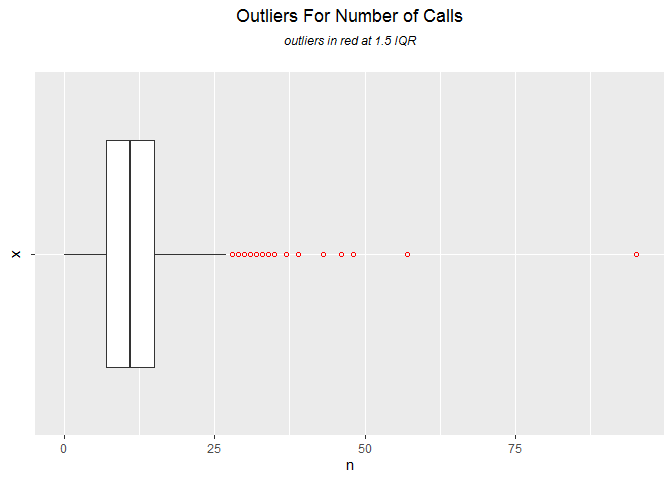

Still Trying
================

Libraries used: tidyverse, lubridate, AER, MASS, sandwich, arm,
fitdistrplus

Reading in the data

``` r
raw<- read.csv("C:/Users/ADMIN/Desktop/SlackFiles/all_vars.csv")
#Factoring Variables
cols<- c('broncos','rockies','nuggets','precip')
  raw[,cols]<- data.frame(apply(raw[cols],2, as.factor))
   raw$wday<-as.factor(raw$wday)
    levels(raw$wday)<- c('Sun','Mon','Tues','Wed','Thurs',
                         'Fri','Sat')
   raw$Hour<-as.factor(raw$Hour)
   raw$Month<-as.factor(raw$Month)
    levels(raw$Month)<-c('Jan','Feb','Mar','Apr','May','Jun',
                         'Jul','Aug','Sep','Oct','Nov','Dec')
levels(raw$precip)<-c('F','T')
levels(raw$nuggets)<-c('n','y')
levels(raw$broncos)<-c('n','y')
levels(raw$rockies)<-c('n','y')
```

\#\#Outliers

Graph of Outliers

``` r
out<-ggplot(data = raw, mapping = aes(x=" ", y = n))+
  geom_boxplot(outlier.color = "red", outlier.shape = 1)+
  ggtitle(expression(atop("Outliers For Number of Calls",
                          atop(italic("outliers in red at 1.5 IQR")))))+
  theme(plot.title = element_text(hjust = 0.5))+
  theme(plot.subtitle = element_text(hjust = 0.5))
out + coord_flip()
```

<!-- -->

Viewing value and Location of Outliers

``` r
outliers = boxplot(raw$n, plot = F)$out
            which(raw$n %in% outliers)
```

    ##   [1]     2     3  7393  8729  8730  8731 17492 18509 22608 26229 26364
    ##  [12] 29621 29929 30706 30989 32477 33650 33747 34979 35786 37292 39163
    ##  [23] 39909 40025 40168 40884 41654 42264 42563 43726 43727 43906 44173
    ##  [34] 44294 44342 44637 44675 45157 45278 45659 46092 47796 48344 48679
    ##  [45] 48749 48992 49615 49951 50768 50793 50992 52207 52505 52785 52978
    ##  [56] 53742 54298 54827 55135 55137 55399 55475 55566 56117 56527 57341
    ##  [67] 57605 57675 57892 57917 58019 58205 58249 58299 58418 58590 58615
    ##  [78] 58994 59138 59411 59455 60702 61263 61636 61708 62214 62774 62779
    ##  [89] 62905 62964 62996 63048 63075 63076 63670 64394 64703 64993 65084
    ## [100] 65544 65661 65929 66141 66382 66548 66887 66907 67300 67392 67485
    ## [111] 67559 67895 67915 68181 68947 70013 70014

``` r
print(outliers)
```

    ##   [1] 37 32 28 33 43 28 31 28 31 39 28 32 31 28 29 29 28 31 32 28 29 31 29
    ##  [24] 32 30 31 30 46 29 30 33 28 30 30 29 28 35 28 28 28 30 28 31 28 28 28
    ##  [47] 28 29 30 28 28 31 30 29 28 33 28 31 30 28 30 28 31 31 31 28 30 29 31
    ##  [70] 29 28 29 31 30 29 30 31 28 28 28 28 29 32 29 29 33 95 57 28 48 28 30
    ##  [93] 31 28 29 28 29 29 29 28 29 28 28 28 32 28 28 28 28 30 29 32 28 29 33
    ## [116] 34 32

``` r
min(outliers)
```

    ## [1] 28

``` r
table(outliers)
```

    ## outliers
    ## 28 29 30 31 32 33 34 35 37 39 43 46 48 57 95 
    ## 42 22 15 16  8  5  1  1  1  1  1  1  1  1  1

Creating new Data frame of just Outliers for further analysis.

``` r
CallOutliers<-raw[which(raw$n %in% outliers),]
CallOutliers
```

    ##                       Date  n Year Hour Month yday  wday   pick hr_index
    ## 2     2011-01-01T01:00:00Z 37 2011    1   Jan    1   Sat Spring       21
    ## 3     2011-01-01T02:00:00Z 32 2011    2   Jan    1   Sat Spring       22
    ## 7393  2011-11-06T01:00:00Z 28 2011    1   Nov  310   Sun   Fall       21
    ## 8729  2012-01-01T00:00:00Z 33 2012    0   Jan    1   Sun Spring       20
    ## 8730  2012-01-01T01:00:00Z 43 2012    1   Jan    1   Sun Spring       21
    ## 8731  2012-01-01T02:00:00Z 28 2012    2   Jan    1   Sun Spring       22
    ## 17492 2013-01-01T01:00:00Z 31 2013    1   Jan    1  Tues Spring       21
    ## 18509 2013-02-12T13:00:00Z 28 2013   13   Feb   43  Tues Spring        9
    ## 22608 2013-08-02T16:00:00Z 31 2013   16   Aug  214   Fri Summer       12
    ## 26229 2014-01-01T01:00:00Z 39 2014    1   Jan    1   Wed Spring       21
    ## 26364 2014-01-06T16:00:00Z 28 2014   16   Jan    6   Mon Spring       12
    ## 29621 2014-05-22T15:00:00Z 32 2014   15   May  142 Thurs Summer       11
    ## 29929 2014-06-04T11:00:00Z 31 2014   11   Jun  155   Wed Summer        7
    ## 30706 2014-07-06T20:00:00Z 28 2014   20   Jul  187   Sun Summer       16
    ## 30989 2014-07-18T15:00:00Z 29 2014   15   Jul  199   Fri Summer       11
    ## 32477 2014-09-18T16:00:00Z 29 2014   16   Sep  261 Thurs   Fall       12
    ## 33650 2014-11-06T15:00:00Z 28 2014   15   Nov  310 Thurs   Fall       11
    ## 33747 2014-11-10T16:00:00Z 31 2014   16   Nov  314   Mon   Fall       12
    ## 34979 2015-01-01T01:00:00Z 32 2015    1   Jan    1 Thurs Spring       21
    ## 35786 2015-02-03T16:00:00Z 28 2015   16   Feb   34  Tues Spring       12
    ## 37292 2015-04-07T15:00:00Z 29 2015   15   Apr   97  Tues Spring       11
    ## 39163 2015-06-24T17:00:00Z 31 2015   17   Jun  175   Wed Summer       13
    ## 39909 2015-07-25T20:00:00Z 29 2015   20   Jul  206   Sat Summer       16
    ## 40025 2015-07-30T16:00:00Z 32 2015   16   Jul  211 Thurs Summer       12
    ## 40168 2015-08-05T15:00:00Z 30 2015   15   Aug  217   Wed Summer       11
    ## 40884 2015-09-04T12:00:00Z 31 2015   12   Sep  247   Fri   Fall        8
    ## 41654 2015-10-06T14:00:00Z 30 2015   14   Oct  279  Tues   Fall       10
    ## 42264 2015-11-01T01:00:00Z 46 2015    1   Nov  305   Sun   Fall       21
    ## 42563 2015-11-13T13:00:00Z 29 2015   13   Nov  317   Fri   Fall        9
    ## 43726 2016-01-01T01:00:00Z 30 2016    1   Jan    1   Fri Spring       21
    ## 43727 2016-01-01T02:00:00Z 33 2016    2   Jan    1   Fri Spring       22
    ## 43906 2016-01-08T13:00:00Z 28 2016   13   Jan    8   Fri Spring        9
    ## 44173 2016-01-19T16:00:00Z 30 2016   16   Jan   19  Tues Spring       12
    ## 44294 2016-01-24T17:00:00Z 30 2016   17   Jan   24   Sun Spring       13
    ## 44342 2016-01-26T17:00:00Z 29 2016   17   Jan   26  Tues Spring       13
    ## 44637 2016-02-08T00:00:00Z 28 2016    0   Feb   39   Mon Spring       20
    ## 44675 2016-02-09T14:00:00Z 35 2016   14   Feb   40  Tues Spring       10
    ## 45157 2016-02-29T16:00:00Z 28 2016   16   Feb   60   Mon Spring       12
    ## 45278 2016-03-05T18:00:00Z 28 2016   18   Mar   65   Sat Spring       14
    ## 45659 2016-03-21T16:00:00Z 28 2016   16   Mar   81   Mon Spring       12
    ## 46092 2016-04-08T19:00:00Z 30 2016   19   Apr   99   Fri Spring       15
    ## 47796 2016-06-18T20:00:00Z 28 2016   20   Jun  170   Sat Summer       16
    ## 48344 2016-07-11T16:00:00Z 31 2016   16   Jul  193   Mon Summer       12
    ## 48679 2016-07-25T15:00:00Z 28 2016   15   Jul  207   Mon Summer       11
    ## 48749 2016-07-28T13:00:00Z 28 2016   13   Jul  210 Thurs Summer        9
    ## 48992 2016-08-07T16:00:00Z 28 2016   16   Aug  220   Sun Summer       12
    ## 49615 2016-09-02T15:00:00Z 28 2016   15   Sep  246   Fri   Fall       11
    ## 49951 2016-09-16T15:00:00Z 29 2016   15   Sep  260   Fri   Fall       11
    ## 50768 2016-10-20T16:00:00Z 30 2016   16   Oct  294 Thurs   Fall       12
    ## 50793 2016-10-21T17:00:00Z 28 2016   17   Oct  295   Fri   Fall       13
    ## 50992 2016-10-30T00:00:00Z 28 2016    0   Oct  304   Sun   Fall       20
    ## 52207 2016-12-19T15:00:00Z 31 2016   15   Dec  354   Mon   Fall       11
    ## 52505 2017-01-01T01:00:00Z 30 2017    1   Jan    1   Sun Spring       21
    ## 52785 2017-01-12T17:00:00Z 29 2017   17   Jan   12 Thurs Spring       13
    ## 52978 2017-01-20T18:00:00Z 28 2017   18   Jan   20   Fri Spring       14
    ## 53742 2017-02-21T14:00:00Z 33 2017   14   Feb   52  Tues Spring       10
    ## 54298 2017-03-16T19:00:00Z 28 2017   19   Mar   75 Thurs Spring       15
    ## 54827 2017-04-07T20:00:00Z 31 2017   20   Apr   97   Fri Spring       16
    ## 55135 2017-04-20T16:00:00Z 30 2017   16   Apr  110 Thurs Spring       12
    ## 55137 2017-04-20T18:00:00Z 28 2017   18   Apr  110 Thurs Spring       14
    ## 55399 2017-05-01T16:00:00Z 30 2017   16   May  121   Mon Summer       12
    ## 55475 2017-05-04T20:00:00Z 28 2017   20   May  124 Thurs Summer       16
    ## 55566 2017-05-08T15:00:00Z 31 2017   15   May  128   Mon Summer       11
    ## 56117 2017-05-31T14:00:00Z 31 2017   14   May  151   Wed Summer       10
    ## 56527 2017-06-17T16:00:00Z 31 2017   16   Jun  168   Sat Summer       12
    ## 57341 2017-07-21T15:00:00Z 28 2017   15   Jul  202   Fri Summer       11
    ## 57605 2017-08-01T15:00:00Z 30 2017   15   Aug  213  Tues Summer       11
    ## 57675 2017-08-04T13:00:00Z 29 2017   13   Aug  216   Fri Summer        9
    ## 57892 2017-08-13T14:00:00Z 31 2017   14   Aug  225   Sun Summer       10
    ## 57917 2017-08-14T15:00:00Z 29 2017   15   Aug  226   Mon Summer       11
    ## 58019 2017-08-18T21:00:00Z 28 2017   21   Aug  230   Fri Summer       17
    ## 58205 2017-08-26T15:00:00Z 29 2017   15   Aug  238   Sat Summer       11
    ## 58249 2017-08-28T11:00:00Z 31 2017   11   Aug  240   Mon Summer        7
    ## 58299 2017-08-30T13:00:00Z 30 2017   13   Aug  242   Wed Summer        9
    ## 58418 2017-09-04T12:00:00Z 29 2017   12   Sep  247   Mon   Fall        8
    ## 58590 2017-09-11T16:00:00Z 30 2017   16   Sep  254   Mon   Fall       12
    ## 58615 2017-09-12T17:00:00Z 31 2017   17   Sep  255  Tues   Fall       13
    ## 58994 2017-09-28T12:00:00Z 28 2017   12   Sep  271 Thurs   Fall        8
    ## 59138 2017-10-04T12:00:00Z 28 2017   12   Oct  277   Wed   Fall        8
    ## 59411 2017-10-15T21:00:00Z 28 2017   21   Oct  288   Sun   Fall       17
    ## 59455 2017-10-17T17:00:00Z 28 2017   17   Oct  290  Tues   Fall       13
    ## 60702 2017-12-08T16:00:00Z 29 2017   16   Dec  342   Fri   Fall       12
    ## 61263 2018-01-01T01:00:00Z 32 2018    1   Jan    1   Mon Spring       21
    ## 61636 2018-01-16T14:00:00Z 29 2018   14   Jan   16  Tues Spring       10
    ## 61708 2018-01-19T14:00:00Z 29 2018   14   Jan   19   Fri Spring       10
    ## 62214 2018-02-09T16:00:00Z 33 2018   16   Feb   40   Fri Spring       12
    ## 62774 2018-03-05T00:00:00Z 95 2018    0   Mar   64   Mon Spring       20
    ## 62779 2018-03-05T05:00:00Z 57 2018    5   Mar   64   Mon Spring        1
    ## 62905 2018-03-10T12:00:00Z 28 2018   12   Mar   69   Sat Spring        8
    ## 62964 2018-03-13T00:00:00Z 48 2018    0   Mar   72  Tues Spring       20
    ## 62996 2018-03-14T11:00:00Z 28 2018   11   Mar   73   Wed Spring        7
    ## 63048 2018-03-16T15:00:00Z 30 2018   15   Mar   75   Fri Spring       11
    ## 63075 2018-03-17T18:00:00Z 31 2018   18   Mar   76   Sat Spring       14
    ## 63076 2018-03-17T19:00:00Z 28 2018   19   Mar   76   Sat Spring       15
    ## 63670 2018-04-11T13:00:00Z 29 2018   13   Apr  101   Wed Spring        9
    ## 64394 2018-05-11T18:00:00Z 28 2018   18   May  131   Fri Summer       14
    ## 64703 2018-05-24T15:00:00Z 29 2018   15   May  144 Thurs Summer       11
    ## 64993 2018-06-05T17:00:00Z 29 2018   17   Jun  156  Tues Summer       13
    ## 65084 2018-06-09T12:00:00Z 29 2018   12   Jun  160   Sat Summer        8
    ## 65544 2018-06-28T18:00:00Z 28 2018   18   Jun  179 Thurs Summer       14
    ## 65661 2018-07-03T15:00:00Z 29 2018   15   Jul  184  Tues Summer       11
    ## 65929 2018-07-14T19:00:00Z 28 2018   19   Jul  195   Sat Summer       15
    ## 66141 2018-07-23T15:00:00Z 28 2018   15   Jul  204   Mon Summer       11
    ## 66382 2018-08-02T16:00:00Z 28 2018   16   Aug  214 Thurs Summer       12
    ## 66548 2018-08-09T14:00:00Z 32 2018   14   Aug  221 Thurs Summer       10
    ## 66887 2018-08-23T17:00:00Z 28 2018   17   Aug  235 Thurs Summer       13
    ## 66907 2018-08-24T13:00:00Z 28 2018   13   Aug  236   Fri Summer        9
    ## 67300 2018-09-09T22:00:00Z 28 2018   22   Sep  252   Sun   Fall       18
    ## 67392 2018-09-13T18:00:00Z 28 2018   18   Sep  256 Thurs   Fall       14
    ## 67485 2018-09-17T15:00:00Z 30 2018   15   Sep  260   Mon   Fall       11
    ## 67559 2018-09-20T17:00:00Z 29 2018   17   Sep  263 Thurs   Fall       13
    ## 67895 2018-10-04T17:00:00Z 32 2018   17   Oct  277 Thurs   Fall       13
    ## 67915 2018-10-05T13:00:00Z 28 2018   13   Oct  278   Fri   Fall        9
    ## 68181 2018-10-16T16:00:00Z 29 2018   16   Oct  289  Tues   Fall       12
    ## 68947 2018-11-17T14:00:00Z 33 2018   14   Nov  321   Sat   Fall       10
    ## 70013 2019-01-01T01:00:00Z 34 2019    1   Jan    1  Tues Spring       21
    ## 70014 2019-01-01T02:00:00Z 32 2019    2   Jan    1  Tues Spring       22
    ##             Temp precip broncos rockies nuggets
    ## 2     -15.000000      F       n       n       n
    ## 3     -15.600000      F       n       n       n
    ## 7393    4.700000      F       n       n       n
    ## 8729    1.100000      F       n       n       n
    ## 8730   -0.600000      F       n       n       n
    ## 8731   -1.700000      F       n       n       n
    ## 17492 -10.000000      F       n       n       n
    ## 18509  -9.400000      F       n       n       n
    ## 22608  27.800000      F       n       n       n
    ## 26229   5.600000      F       n       n       n
    ## 26364 -13.900000      F       n       n       n
    ## 29621  15.600000      F       n       y       n
    ## 29929  11.120000      F       n       n       n
    ## 30706  35.600000      F       n       n       n
    ## 30989  25.000000      F       n       n       n
    ## 32477  23.300000      F       n       n       n
    ## 33650   5.000000      F       n       n       n
    ## 33747  17.250000      F       n       n       n
    ## 34979 -11.700000      F       n       n       n
    ## 35786   7.800000      F       n       n       n
    ## 37292   6.866667      F       n       n       n
    ## 39163  29.266667      F       n       n       n
    ## 39909  32.200000      F       n       y       n
    ## 40025  24.400000      F       n       n       n
    ## 40168  25.000000      F       n       y       n
    ## 40884  15.000000      T       n       n       n
    ## 41654  11.100000      F       n       n       n
    ## 42264  12.200000      F       n       n       n
    ## 42563  -3.300000      F       n       n       n
    ## 43726 -11.700000      F       n       n       n
    ## 43727 -12.800000      F       n       n       n
    ## 43906  -5.766667      T       n       n       n
    ## 44173   1.100000      F       n       n       n
    ## 44294   6.100000      F       n       n       n
    ## 44342  -0.600000      F       n       n       n
    ## 44637  -3.300000      F       n       n       n
    ## 44675   0.600000      F       n       n       n
    ## 45157   8.900000      F       n       n       n
    ## 45278  13.300000      F       n       n       n
    ## 45659  15.000000      F       n       n       n
    ## 46092  16.100000      F       n       n       y
    ## 47796  31.100000      F       n       n       n
    ## 48344  21.700000      F       n       n       n
    ## 48679  21.100000      F       n       n       n
    ## 48749  16.100000      F       n       n       n
    ## 48992  18.225000      F       n       y       n
    ## 49615  18.300000      F       n       n       n
    ## 49951  12.200000      F       n       n       n
    ## 50768   7.800000      F       n       n       n
    ## 50793  22.200000      F       n       n       n
    ## 50992  18.300000      F       n       n       n
    ## 52207 -12.800000      F       n       n       n
    ## 52505  -2.800000      F       n       n       n
    ## 52785   2.200000      F       n       n       n
    ## 52978   2.033333      F       n       n       n
    ## 53742   7.800000      F       n       n       n
    ## 54298  22.800000      F       n       n       y
    ## 54827  24.400000      F       n       n       y
    ## 55135  11.700000      F       n       n       n
    ## 55137  15.600000      F       n       n       n
    ## 55399  13.900000      F       n       n       n
    ## 55475  20.600000      F       n       n       n
    ## 55566  15.600000      F       n       n       n
    ## 56117  14.400000      F       n       n       n
    ## 56527  25.000000      F       n       y       n
    ## 57341  25.600000      F       n       n       n
    ## 57605  22.800000      F       n       n       n
    ## 57675  14.433333      F       n       n       n
    ## 57892  18.300000      F       n       n       n
    ## 57917  23.300000      F       n       n       n
    ## 58019  30.000000      F       n       y       n
    ## 58205  23.900000      F       n       n       n
    ## 58249  17.200000      F       n       n       n
    ## 58299  14.400000      F       n       y       n
    ## 58418  16.850000      F       n       n       n
    ## 58590  26.700000      F       n       n       n
    ## 58615  27.200000      F       n       n       n
    ## 58994  10.000000      T       n       n       n
    ## 59138  10.000000      F       n       n       n
    ## 59411  17.800000      F       y       n       n
    ## 59455  20.000000      F       n       n       n
    ## 60702   7.800000      F       n       n       n
    ## 61263 -13.300000      F       n       n       n
    ## 61636 -15.000000      F       n       n       n
    ## 61708  10.000000      F       n       n       n
    ## 62214  -6.100000      F       n       n       n
    ## 62774  10.766667      F       n       n       n
    ## 62779   2.800000      F       n       n       n
    ## 62905   6.100000      F       n       n       n
    ## 62964  11.700000      F       n       n       n
    ## 62996   1.100000      F       n       n       n
    ## 63048   2.200000      F       n       n       n
    ## 63075  14.400000      F       n       n       n
    ## 63076  15.000000      F       n       n       n
    ## 63670  11.100000      F       n       y       n
    ## 64394  20.000000      F       n       y       n
    ## 64703  19.400000      F       n       n       n
    ## 64993  32.200000      F       n       n       n
    ## 65084  16.850000      F       n       n       n
    ## 65544  37.600000      F       n       n       n
    ## 65661  26.100000      F       n       n       n
    ## 65929  33.300000      F       n       y       n
    ## 66141  21.100000      F       n       n       n
    ## 66382  25.000000      F       n       n       n
    ## 66548  20.000000      F       n       n       n
    ## 66887  27.200000      F       n       n       n
    ## 66907  17.200000      F       n       n       n
    ## 67300  30.600000      F       n       n       n
    ## 67392  31.700000      F       n       n       n
    ## 67485  24.400000      F       n       n       n
    ## 67559  20.600000      F       n       n       n
    ## 67895  16.700000      F       n       n       n
    ## 67915   7.800000      F       n       n       n
    ## 68181   7.200000      F       n       n       n
    ## 68947  -0.600000      F       n       n       n
    ## 70013 -13.600000      F       n       n       n
    ## 70014 -13.150000      F       n       n       n

ie there are multilple New Years days on a quick glance. Could look for
patterns in the outliers to suggest days where more staffing is needed
etc.

Removing Outliers to attempt better model fit

``` r
calls<- raw %>% 
   mutate(Date = ymd_hms(raw$Date)) %>%  
  filter(n < 28 & n > 0)
```

I removed 0 as well, not only to help try and fit a better model but as
far as any staffing recommendations there will never be 0 ambulances as
a rec

\#\#Outliers Filtered

quick view of data

``` r
par(mfrow = c(2,2))
hist(calls$n, main = "No Outliers", xlab= 'Calls', xlim = c(1,28))
hist(raw$n, main = 'Outliers', xlab = 'Calls')
boxplot(calls$n, horizontal = T)
```

<!-- -->

\#\#Distribution of Response variable n

``` r
#library(fitdistrplus)
Calls.Poi<- fitdist(calls$n, "pois")
Calls.NB<- fitdist(calls$n, "nbinom")

denscomp(list(Calls.Poi, Calls.NB),
         legendtext = c('Poisson','NegBin'),fitlty = 1)
```

<!-- -->

``` r
cdfcomp(list(Calls.Poi, Calls.NB),
         legendtext = c('Poisson','NegBin'),fitlty = 1)
```

<!-- --> GOF

``` r
gofstat(list(Calls.Poi, Calls.NB),
        fitnames = c('Poisson','NegBin'))
```

    ## Chi-squared statistic:  98203.46 1638.596 
    ## Degree of freedom of the Chi-squared distribution:  22 21 
    ## Chi-squared p-value:  0 0 
    ## Chi-squared table:
    ##       obscounts theo Poisson theo NegBin
    ## <= 1        481     13.28360    418.8378
    ## <= 2       1180     67.45583    875.7144
    ## <= 3       2114    248.98918   1663.8067
    ## <= 4       3025    689.29124   2617.1521
    ## <= 5       3673   1526.56401   3603.3457
    ## <= 6       4119   2817.38395   4489.9079
    ## <= 7       4518   4456.87303   5175.1749
    ## <= 8       4770   6169.11040   5602.4516
    ## <= 9       4967   7590.35869   5759.7168
    ## <= 10      5006   8405.13254   5670.3098
    ## <= 11      5176   8461.24260   5380.0452
    ## <= 12      5022   7807.91664   4944.7287
    ## <= 13      4772   6650.80298   4420.2745
    ## <= 14      4258   5260.51561   3856.1566
    ## <= 15      3801   3883.46434   3291.9873
    ## <= 16      3252   2687.70504   2756.5419
    ## <= 17      2758   1750.71298   2268.4260
    ## <= 18      2222   1077.02234   1837.6585
    ## <= 19      1686    627.70181   1467.6109
    ## <= 20      1259    347.54068   1156.9267
    ## <= 21       966    183.26040    901.2050
    ## <= 22       660     92.24189    694.3535
    ## <= 24       767     64.90074    929.7652
    ## > 24        443     15.52950   1112.9023
    ## 
    ## Goodness-of-fit criteria
    ##                                 Poisson   NegBin
    ## Akaike's Information Criterion 464469.7 429122.1
    ## Bayesian Information Criterion 464478.9 429140.4
